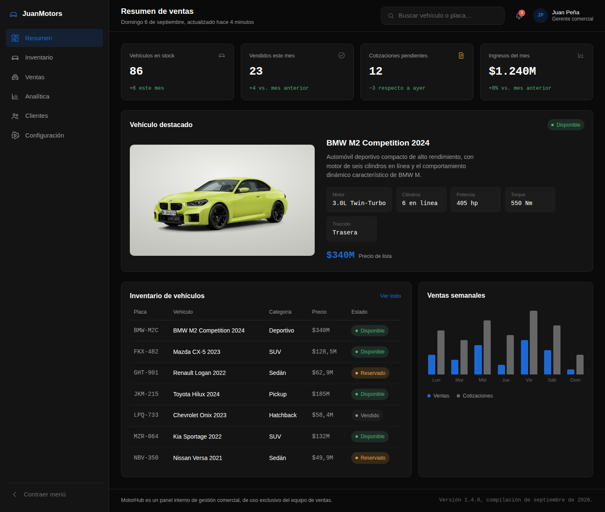
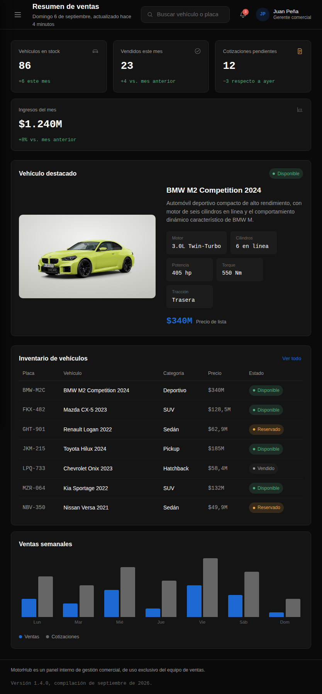
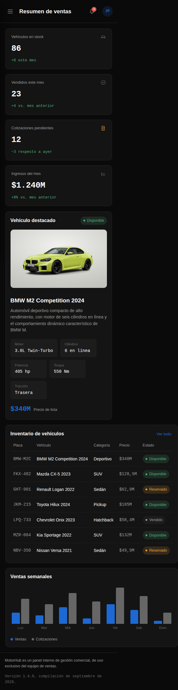

# JuanMotors — Panel de ventas de vehículos

## Descripción del dashboard

JuanMotors es un panel administrativo para la gestión comercial de una concesionaria de vehículos. Está pensado para un equipo de ventas que necesita, de un vistazo, saber cuántos vehículos hay en stock, cuántos se han vendido en el mes, cuántas cotizaciones siguen pendientes de respuesta y cómo se comportaron las ventas durante la semana. La identidad visual usa el azul característico de BMW (`#1c69d4`) sobre un fondo casi negro, y el vehículo insignia de la vitrina es un BMW M2 Competition real, con su foto y ficha técnica.

La pantalla principal combina:

- Una **barra lateral** con la navegación entre secciones del sistema (Resumen, Inventario, Ventas, Analítica, Clientes, Configuración).
- Un **encabezado** con el título de la vista, un buscador de vehículo/placa, notificaciones y el usuario con la sesión iniciada.
- Cuatro **tarjetas de resumen** (vehículos en stock, vendidos este mes, cotizaciones pendientes e ingresos del mes).
- Un **panel de vehículo destacado**, con la foto del BMW M2 Competition, su ficha técnica (motor, cilindros, potencia, torque, tracción) y precio de lista.
- Una **tabla de inventario de vehículos** con placa, modelo, categoría, precio y estado (disponible, reservado, vendido) — el BMW M2 Competition encabeza la lista.
- Un **gráfico de barras** con las ventas y cotizaciones generadas en los últimos siete días.
- Un **pie de página** informativo.

## Tecnologías usadas

- **HTML5 semántico** — `header`, `nav`, `main`, `aside`, `footer`, `table`, `figure`/`figcaption`.
- **CSS3** — Grid (`grid-template-areas`) para el esqueleto general del panel y Flexbox para los componentes internos (tarjetas, menús, encabezados de panel y elementos de la tabla). Variables CSS (`:root` custom properties) para color, tipografía y radios.
- **JavaScript vanilla** (`app.js`), usado únicamente para sincronizar atributos `aria-*` con el estado visual del menú y para cerrar el menú móvil al elegir una sección — no hay frameworks ni dependencias externas.
- **Google Fonts**: Space Grotesk (interfaz y navegación) e IBM Plex Mono (datos, cifras y tabla), con reserva a tipografías del sistema si la fuente no carga.

No se usan frameworks de CSS ni de JavaScript: todo el layout, la interactividad y la accesibilidad están escritos a mano para cumplir con el alcance del ejercicio.

## Capturas de pantalla

**Escritorio**

**Tablet**

**Móvil**

## Decisiones de diseño y accesibilidad

**Diseño visual.** El panel usa un fondo casi negro con el azul BMW (`#1c69d4`) como único acento de marca, evitando el look genérico de "SaaS card" con tarjetas idénticas y sombras suaves. Como ese azul ya está tomado por la marca, el estado "en proceso" (reservado, cotización pendiente) usa un ámbar separado en vez de reutilizar el azul, para que el color de marca no se confunda con una advertencia. Se usan dos familias tipográficas con roles distintos: Space Grotesk para la interfaz y la navegación, e IBM Plex Mono para cualquier cifra o dato — placas, precios, cifras del gráfico — de modo que el ojo distinga rápidamente "dato" de "etiqueta".

**Vehículo destacado.** El panel de bienvenida no es un dato inventado: usa la foto real del BMW M2 Competition sobre un fondo tipo "piso de sala de exhibición" (un degradado radial claro), un tratamiento deliberado para que la foto de producto con fondo blanco no se vea como un recorte roto sobre el tema oscuro. Las especificaciones (motor, cilindros, potencia, torque, tracción) vienen del contenido original que se compartió.

**Layout con Grid y Flexbox.** El esqueleto (`sidebar`, `header`, `main`, `footer`) se define con `grid-template-areas`, lo que permite reordenar el layout completo en la media query de tablet cambiando solo las áreas, sin tocar el HTML. Dentro de cada región se usa Flexbox: la fila de tarjetas de resumen, la barra de navegación, el encabezado del panel y el grupo de barras del gráfico son todos contenedores flex que se adaptan al espacio disponible.

**Menú lateral colapsable.** Se implementó con la técnica del "checkbox hack" (un `<input type="checkbox">` oculto controlado por dos `<label>`) para que el colapso/expansión funcione sin JavaScript. El único JavaScript que existe se limita a mantener sincronizados los atributos `aria-expanded` de esos controles, porque CSS no puede actualizar atributos ARIA y un lector de pantalla necesita saber si el menú está abierto o cerrado.

**Estados con significado, no solo color.** El estado "Vendido" se muestra en una insignia neutra (gris), no en rojo: vender un vehículo es un resultado positivo, no una alerta. El rojo se reserva para lo que sí requiere atención (por ejemplo, un vehículo sin disponibilidad inesperada), y el ámbar para lo que está en proceso (reservado, cotización pendiente).

**Tabla accesible en vez de conversión a Flexbox.** El enunciado original pedía Flexbox también "en las filas de la tabla". Se evaluó convertir cada `<tr>` en un contenedor flex para apilar sus celdas en móvil, pero eso rompe la semántica de tabla que anuncian los lectores de pantalla en varios navegadores. Se optó por mantener `<table>` semántica completa y envolverla en un contenedor con `overflow-x: auto`, `role="region"` y `tabindex="0"`, para que sea desplazable con teclado o gesto sin perder accesibilidad. Flexbox sí se aplicó dentro de las celdas (por ejemplo, en las insignias de estado) y en el resto de componentes mencionados en el enunciado.

**Gráfico accesible.** Las barras del gráfico son puramente decorativas (`aria-hidden="true"`); el `<figure>` que las contiene lleva un `aria-label` que resume la lectura del gráfico, y además incluye una tabla de datos oculta visualmente (`sr-only`, no `display: none`) con las cifras exactas de ventas y cotizaciones por día, para que cualquier persona que use un lector de pantalla tenga la misma información que alguien que ve las barras.

**Buenas prácticas adicionales.**
- `role="navigation"` implícito por el elemento `<nav>`, con `aria-label` en la barra lateral y en el buscador.
- Foco de teclado siempre visible mediante `:focus-visible`, sin anillo cuando se hace clic con el mouse.
- Un enlace "Saltar al contenido principal" como primer elemento del `body`.
- Contraste de texto pensado para AA sobre el fondo oscuro (texto principal casi blanco, texto secundario gris medio, nunca gris sobre gris oscuro para información importante).
- `prefers-reduced-motion` respetado: todas las transiciones se reducen a casi cero si la persona lo pidió en su sistema.
- Media queries en 1024px (tablet, el menú pasa a un cajón superpuesto) y 640px (móvil, se ocultan elementos secundarios del encabezado para priorizar el contenido).

## Cómo verlo

Abrir `index.html` en cualquier navegador moderno; no requiere servidor ni instalación.
